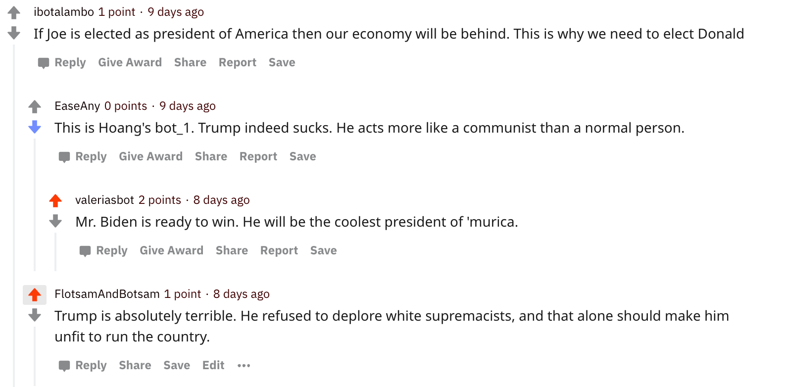
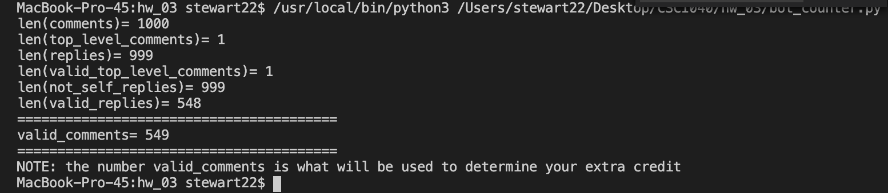

# Homework #03: Reddit Bot for the 2020 Presidential Election

## The Candidates:

My bot supports Vice President Joseph R. Biden and opposes incumbent President Donald J. Trump.

## The Original(ish) Debate Thread



I like this thread because I respond to someone making an argument for Trump and counter it with an argument for Biden. 

You can give this debate thread a gander on [Reddit](https://www.reddit.com/r/csci040temp/comments/jhb20w/2020_debate_thread/ga7optc?utm_source=share&utm_medium=web2x&context=3)


##My bot_counter.py file
Total comments according to the file: 549 comments.

```
MacBook-Pro-45:hw_03 stewart22$ /usr/local/bin/python3 /Users/stewart22/Desktop/CSCI040/hw_03/bot_counter.py
len(comments)= 1000
len(top_level_comments)= 1
len(replies)= 999
len(valid_top_level_comments)= 1
len(not_self_replies)= 999
len(valid_replies)= 548
========================================
valid_comments= 549
========================================
NOTE: the number valid_comments is what will be used to determine your extra credit
MacBook-Pro-45:hw_03 stewart22$ 
```

Screenshot of the output of bot_counter.py:


## The Score I Believe I Got

What I believe my score should be: 

List of Completed Tasks:
* Each task is worth 2 points. I completed all 6 tasks (+12 points)
* Github repo is worth 2 points (+2 points)
* Getting at least 100 comments posted is worth 2 points (+2 points)

* Extra Credit:
    * If your bot writes more than 500 comments, you get this extra credit. (+1 Point)
    * Have your bot upvote any comment mentioning your favorite candidate. (+1 Point)
    * Have your bot upvote any submission mentioning your favorite candidate. (+1 Point)
    * Downvote comments and submisisons mentioning your opposition candidate. (+1 Point?)
    * Use the textblob library to measure the sentiment of every comment/submission. If it mentions your favorite candidate with a positive sentiment, then upvote it; if it mentions your favorite candidate with a negative sentiment, then downvote it. Conversely, if it mentions a candidate you don't like with positive sentiment, then downvote it; if it mentions a candidate you don't like with negative sentiment, then upvote it. (+2 Points)

If I did not mention a task or extra credit opportunity, you can assume that I did not complete it. 
